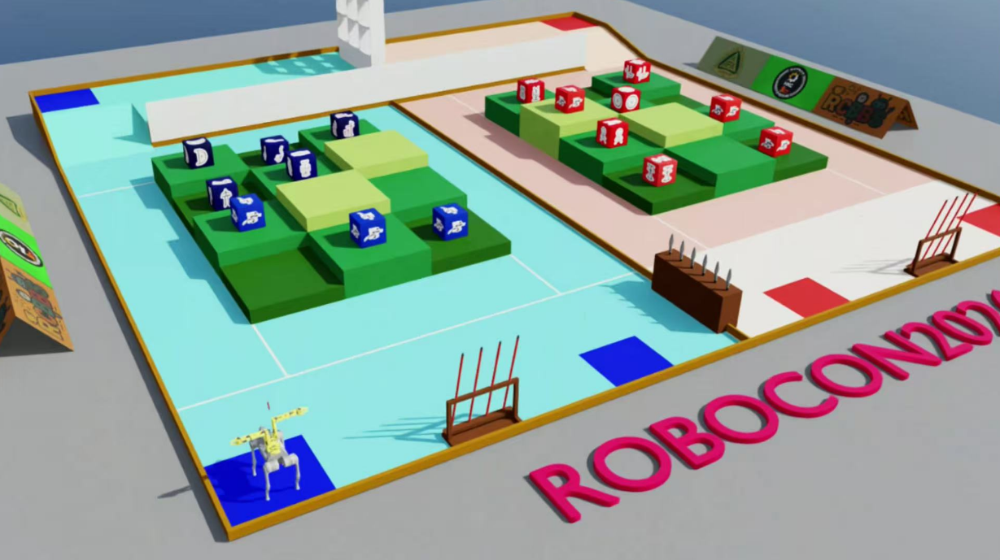
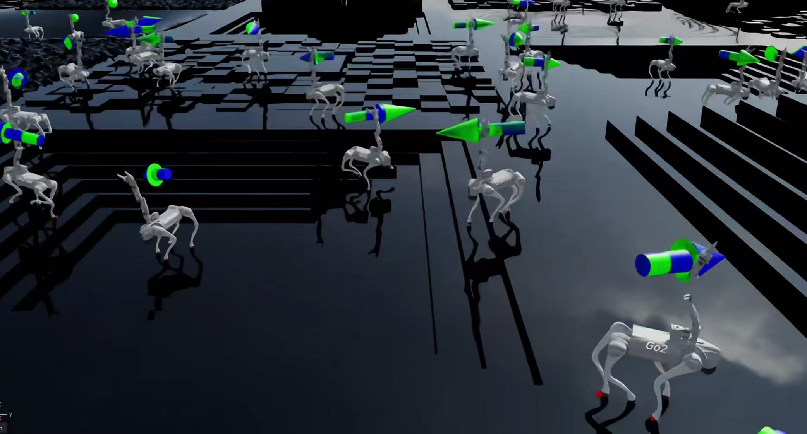
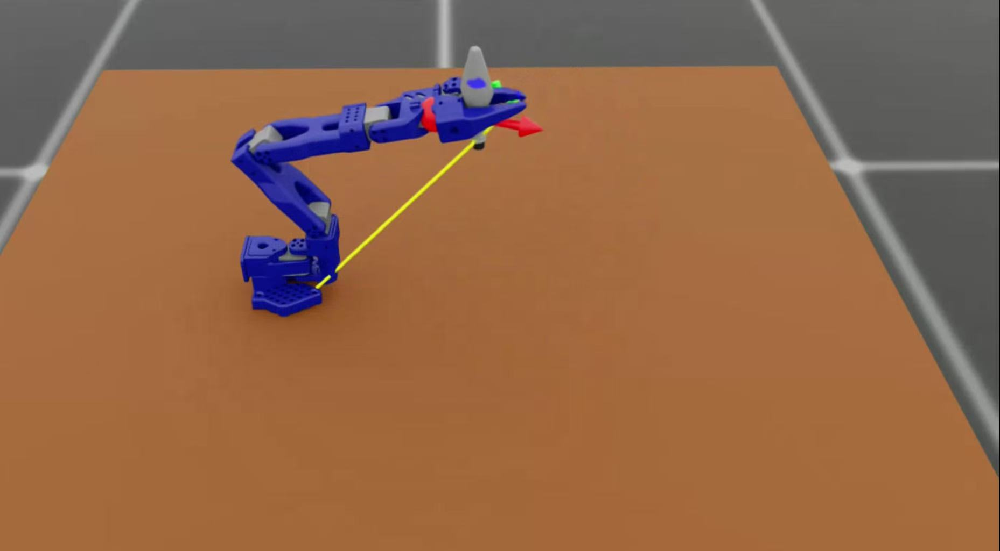
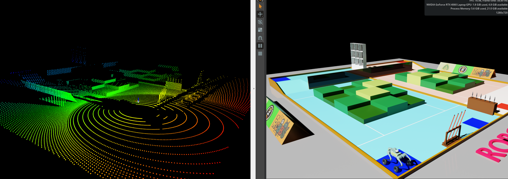
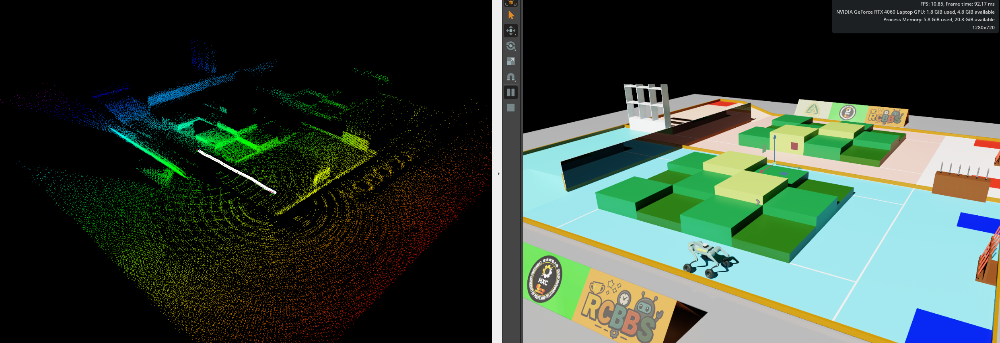

# RC2026_SIM：ROBOCON2026 仿真环境

## 项目概述

本项目是 ROBOCON2026 IsaacacSim 仿真环境，基于 Isaac Lab 开发，集成了重庆邮电大学 HXC 战队在 rcbbs 分享的 3D 模型，用于机器人算法开发与测试。



## 安装指南

### 前置条件

> [!important]
>
> 资产文件在百度网盘：
>
> 链接: https://pan.baidu.com/s/192W4uDKmPrswztege8Sm-A?pwd=5iff 提取码: 5iff

1. 安装 Isaac Lab，遵循官方[安装指南](https://isaac-sim.github.io/IsaacLab/main/source/setup/installation/index.html)

   - 推荐使用 conda 安装方式，便于从终端调用 Python 脚本

2. 克隆本仓库（放在 Isaac Lab 目录之外）：

   ```bash
   git clone https://github.com/Kuriharamio/RC2026_SIM.git
   cd RC2026_SIM
   ```

3. 验证安装是否成功：

   - 列出可用任务：

     ```bash
     python scripts/list_envs.py
     ```

> - 输出如下（省略了 `Entry Point` 和 `Config`）
>
>   ```python
>   +---------------------------------------------------------------+
>   |          Available Environments in Isaac Lab              	|
>   +--------+------------------------------------------------------|
>   | S. No. | 					Task Name              		    	|
>   +--------+------------------------------------------------------|
>   |   1    | Template-Arm-Control-Lift-v0                       	|
>   |   2    | Template-Arm-Control-Lift-Play-v0                 	|
>   |   3    | Template-Arm-Control-Lift-Distillation-Vision-v0   	|
>   |   4    | Template-Arm-Control-Lift-Distillation-Vision-Play-v0| 
>   |   5    | Template-Arm-Control-Lift-Finetune-Vision-v0			|
>   |   6    | Template-Arm-Control-Lift-Finetune-Vision-Play-v0	| 
>   |   7    | Template-Assemble-Weapon-Dual-v0         			|     
>   |   8    | Template-Assemble-Weapon-Dual-Play-v0             	|
>   |   9    | Template-Assemble-Weapon-Single-v0                 	|
>   |   10   | Template-Assemble-Weapon-Single-Play-v0           	|
>   |   11   | Template-Basic-Control-Flat-GO2W-v0               	|
>   |   12   | Template-Basic-Control-Flat-GO2W-Play-v0           	|
>   |   13   | Template-Basic-Control-Rough-GO2W-v0               	|
>   |   14   | Template-Basic-Control-Rough-GO2W-Play-v0         	|
>   |   15   | Template-Basic-Control-Flat-GO2-v0                 	|
>   |   16   | Template-Basic-Control-Flat-GO2-Play-v0           	|
>   |   17   | Template-Basic-Control-Rough-GO2-v0               	|
>   |   18   | Template-Basic-Control-Rough-GO2-Play-v0           	|
>   |   19   | Template-Basic-Control-Flat-ArmDog-v0             	|
>   |   20   | Template-Basic-Control-Flat-ArmDog-Play-v0         	|
>   |   21   | Template-Basic-Control-Rough-ArmDog-v0             	|
>   |   22   | Template-Basic-Control-Rough-ArmDog-Play-v0       	|
>   +--------+------------------------------------------------------+
>   ```

### IDE 设置

1. 运行 VSCode 任务：
   - 按下`Ctrl+Shift+P`
   - 选择`Tasks: Run Task`
   - 在下拉菜单中选择`setup_python_env`
   - 运行任务时，会提示输入 Isaac Sim 安装的绝对路径
2. 成功执行后，会在`.vscode`目录下创建`.python.env`文件，包含 Isaac Sim 提供的所有扩展的 Python 路径，有助于代码提示功能。

## 使用指南

### 测试地图仿真环境

```bash
python scripts/test_core/setup_scene.py
```

### 运行任务

```bash
python scripts/rsl_rl/train.py --task=<TASK_NAME>
```

目前包含多种任务环境配置，主要包括：

1. **四足控制环境（BasicControlEnv）**：

   - 基础步态控制

     

   ```python
   ############################ GO2W ############################
   |   11   | Template-Basic-Control-Flat-GO2W-v0               
   |   12   | Template-Basic-Control-Flat-GO2W-Play-v0           
   |   13   | Template-Basic-Control-Rough-GO2W-v0               
   |   14   | Template-Basic-Control-Rough-GO2W-Play-v0    
   ############################# GO2 ############################
   |   15   | Template-Basic-Control-Flat-GO2-v0                 
   |   16   | Template-Basic-Control-Flat-GO2-Play-v0           
   |   17   | Template-Basic-Control-Rough-GO2-v0               
   |   18   | Template-Basic-Control-Rough-GO2-Play-v0    
   ######################## GO2W+SO-Arm101 ######################
   |   19   | Template-Basic-Control-Flat-ArmDog-v0             
   |   20   | Template-Basic-Control-Flat-ArmDog-Play-v0         
   |   21   | Template-Basic-Control-Rough-ArmDog-v0             
   |   22   | Template-Basic-Control-Rough-ArmDog-Play-v0 
   ```

2. **机械臂 SO-Arm-101 控制环境（ArmControlEnv）**：

   - 夹取目标物品并抬升

     

   ```python
   ########################  SO-Arm101 夹取任务 ######################## 
   |   1    | Template-Arm-Control-Lift-v0                       
   |   2    | Template-Arm-Control-Lift-Play-v0                 
   |   3    | Template-Arm-Control-Lift-Distillation-Vision-v0   
   |   4    | Template-Arm-Control-Lift-Distillation-Vision-Play-v0 
   |   5    | Template-Arm-Control-Lift-Finetune-Vision-v0
   |   6    | Template-Arm-Control-Lift-Finetune-Vision-Play-v0 
   ######################  组装武器，未测试，仅供参考 ###################### 
   |   7    | Template-Assemble-Weapon-Dual-v0                   
   |   8    | Template-Assemble-Weapon-Dual-Play-v0             
   |   9    | Template-Assemble-Weapon-Single-v0                 
   |   10   | Template-Assemble-Weapon-Single-Play-v0  
   ```
   

### 使用虚拟代理运行任务

虚拟 agent（输出零动作或随机动作）用于验证环境配置是否正确：

- `zero_agent`：

  ```bash
  python scripts/zero_agent.py --task=<TASK_NAME>
  ```

- `random_agent`：

  ```bash
  python scripts/random_agent.py --task=<TASK_NAME>
  ```

### ROS2 集成 （键盘控制 +  SLAM）

项目包含 ROS2 工作空间，用于部署训练好的策略：

1. 构建 ROS2 包：

   ```bash
   cd ros2_ws
   colcon build
   source install/setup.bash
   ```

2. 运行控制器节点：

   ```bash
   ros2 launch deploy_policy go2w_controller.launch.py
   ```

   可配置参数：

   - `policy_path`：策略文件路径

3. 打开仿真场景并启动（assets/Simulation/sim.usd）

4. 启动键盘控制节点

   ```bash
   ros2 run teleop_twist_keyboard teleop_twist_keyboard 
   ```

5. 如果需要运行 FastLIO2，在这之后直接 launch 即可（如果没有使用过，请遵循 [FastLIO 安装](https://github.com/Kuriharamio/FAST_LIO/tree/ROS2?tab=readme-ov-file#1-prerequisites)）

   ```bash
   ros2 launch fast_lio mapping.launch.py config_file:=VLS.yaml
   ```






